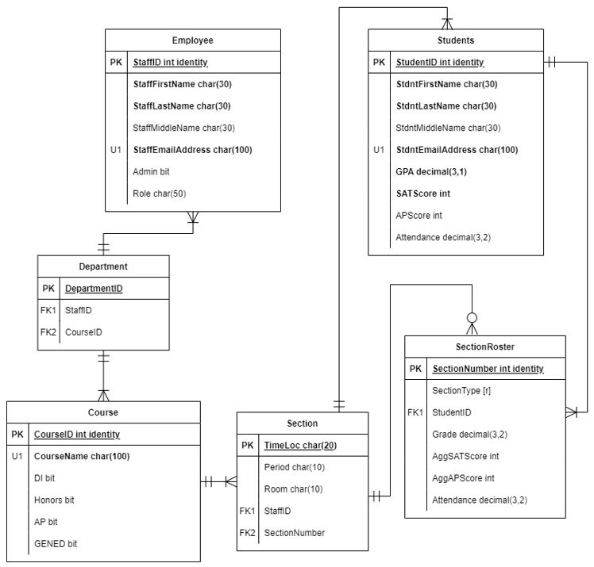
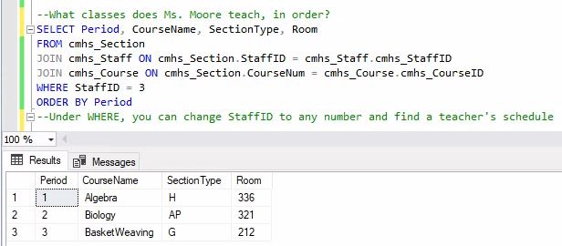

# SQL School Scheduling Database

A relational database designed to organize course offerings, class sections, teacher assignments, student enrollment, schedules, and academic performance data for a fictional high school.

This project demonstrates how operational requirements can be translated into business rules, normalized data models, SQL database structures, and business-facing queries.

## Project Overview

School scheduling requires information about courses, sections, instructors, students, rooms, periods, enrollment, grades, and attendance to remain consistent across multiple workflows.

The database was designed to support questions such as:
- What is a teacher's schedule?
- What is a student's schedule?
- Which students are enrolled in each course section?
- How do grades, GPA, attendance, and assessment results vary across sections?
- How can administrative scheduling data remain separate from student
  performance records while still supporting integrated reporting?

## Technical Skills Demonstrated
- SQL
- Relational database design
- Conceptual and logical data modeling
- Database normalization
- Primary and foreign keys
- One-to-many and many-to-many relationships
- Data types and integrity constraints
- SQL joins
- Views
- Aggregate queries
- Business-rule documentation
- Iterative schema refinement

## Data Model
The database connects five core operational areas:
- Staff
- Courses
- Sections
- Students
- Section rosters

The structure separates course definitions, scheduled class sections, staff assignments, student records, and enrollment-level performance information.

## Example Query:  Teacher Schedule

This query joins staff, section, and course data to retrieve a teacher's scheduled classes in period order.

## Development Process

1. Defined the business case, stakeholders, and reporting questions.
2. Documented business rules governing courses, sections, instructors, students, and rosters.
3. Created an initial conceptual entity-relationship model.
4. Converted the model into a normalized logical schema.
5. Implemented the database using SQL.
6. Populated sample records and tested table relationships.
7. Wrote queries and views for schedules and section-level performance.
8. Revised keys, table relationships, and derived attributes based on testing.

## Key Design Decisions

- Course definitions are stored separately from scheduled course sections.
- Administrative section information, such as period, room, and instructor, is separated from student enrollment and grade data.
- The roster table resolves the many-to-many relationship between students and class sections.
- Unique identifiers support consistent relationships across tables.
- Derived section-level metrics are calculated through queries rather than redundantly stored in transactional tables.

## Future Improvements

- Add explicit foreign-key constraints and validation checks.
- Add indexes for frequently queried schedule and enrollment fields.
- Create stored procedures for common reporting requests.
- Add automated tests for duplicate schedules and invalid enrollments.
- Expand the model to include departments, semesters, prerequisites, and historical enrollment.
- Rebuild the project in a modern relational platform such as PostgreSQL or SQL Server.
